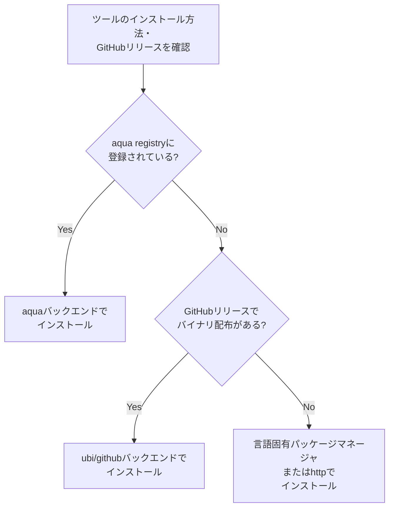

# はじめに

最近なにかとmiseの話を聞く機会が少しずつ増えてきました。
今回は、miseを使ってCLIツールを一元管理する方法について紹介します。

## miseとは？

miseは言語ランタイムのバージョン管理をはじめとした以下のような様々な機能があります。

- 言語ランタイムのインストール・バージョン管理(`asdf`相当)
- **CLIツールのインストール・バージョン管理機能**(`aqua`相当)
- タスクランナー機能(`make`相当)
- ディレクトリに応じた環境切り替え機能(`direnv`相当)

miseはこれらの機能を一つのツールで包括的に提供しているのが特徴です。

多くの人は言語ランタイムのバージョン管理などの特定の機能としてのmiseを知っているかもしれませんが、実はオールインワンとも呼べるほど多機能であることはあまり知られていないかもしれません。

そこで、今回はCLIの管理ツールとしてのmiseの機能を中心に、miseで管理する方法やTIPSなどを紹介します。

## miseの特徴
### tomlファイルでツールを宣言的にバージョン管理
miseは[aqua](https://github.com/aquaproj/aqua)と似たようにCLIツールも宣言的にバージョン管理することができます。

miseではtomlファイルでツールとそのバージョンを指定します。

```toml
# mise.toml
[tools]
jq      = "latest"
node    = "22.19.0"
python  = "3.14.0"
tmux    = "3.5"
```

### 豊富なバックエンドに対応
miseは多様なパッケージマネージャのツールをインストール・管理することができます。
それらをmiseでは「[バックエンド](https://mise.jdx.dev/dev-tools/backends/)」と呼んでいます。

2025/12現在で対応しているバックエンドは以下です。
- asdf
- aqua
- cargo
- gem
- github
- gitlab
- go
- http
- npm
- pipx
- ubi
- vfox

主要なパッケージマネージャは対応していることがわかると思います。
上記パッケージマネージャのツールをmiseを通してインストールすることができます。

### 使い方
CLIを管理する際の基本的な使い方は、言語ランタイムを管理する際のmiseとほぼ同じです。

`-g`オプションを付けない場合は、ローカルの`./mise.toml`、
`-g`オプションを付けた場合はグローバルの`$XDG_CONFIG_HOME/mise/config.toml`にインストールしたツールとバージョンが記録されます。(以降は、基本的にグローバル管理の例で説明します)

- ツールのインストール
```sh
mise install -g <tool>@<version>
```

- ツールのインストールおよびactivate
```sh
mise use -g <tool>
```

- ツールをインタラクティブに選択してインストール
インストール可能なツールを確認したい場合は`<tool>`を指定せずに`mise use`のみで実行することで確認が可能です
```sh
mise use -g
```

#### バックエンドの指定有無
登録されているツールの場合は、明示的にバックエンドを指定せずともインストール可能です。
その場合は自動的に優先度に従ってバックエンドを選択してくれます。

mise側で登録済みのツールと対応するバックエンド一覧は以下のコマンドで確認できます。
- 登録済みのツールと対応するバックエンド一覧
```sh
~ % mise registry

Tool                          Backends
1password                     vfox:mise-plugins/vfox-1password aqua:1password/cli
1password-cli                 vfox:mise-plugins/vfox-1password aqua:1password/cli
aapt2                         vfox:mise-plugins/vfox-aapt2
act                           aqua:nektos/act ubi:nektos/act asdf:gr1m0h/asdf-act
action-validator              aqua:mpalmer/action-validator ubi:mpalmer/action-validator asdf:mpalmer/action-validator cargo:action-validator
actionlint                    aqua:rhysd/actionlint ubi:rhysd/actionlint asdf:crazy-matt/asdf-actionlint go:github.com/rhysd/actionlint/cmd/actionlint
...
```
- ツールの詳細情報確認
```sh
mise tool <tool>

# 例
~ % mise tool fzf
Backend:            aqua:junegunn/fzf
Description:        :cherry_blossom: A command-line fuzzy finder
Installed Versions: 0.64.0
Tool Options:       [none]
Security:           checksum (sha256)
```

一方で、miseのcoreとして組み込まれている言語ランタイム系とは違い、CLIツールの場合は自分がインストールしたいツールがmiseに登録されているとは限りません。
また、mise側に組み込まれていないツールに関しては、こちらで明示的にバックエンドを指定することで、miseに登録されていないツールもインストールすることが可能です。

例として、renovate CLIはnpm packageとして配布されていますが、現時点ではmiseの登録ツールには含まれていません。
そのため、バックエンドの指定無しではインストールできませんが、以下のようにnpmバックエンドを指定することでインストール可能です。
```sh
# バックエンド指定無しでは、ツールとして登録されていないためエラー
mise use -g renovate
# 明示的にバックエンド(npm)指定
mise use -g npm:renovate
```

このようにして、miseに登録されていないツールもバックエンドを指定することでほぼインストールすることができます。

#### CLIツール管理例

CLIツールをmiseで管理する際も、言語ランタイムの場合と同様です。

グローバルに管理する場合は、miseは設定ファイルの置き場は`$XDG_CONFIG_HOME`に対応しています。
そのため、設定ファイルは是非`$XDG_CONFIG_HOME/mise/config.toml`に記述しましょう。
設定ファイルを作成して、`mise install -g`を実行することで、一括でツールをインストールできます。


## miseでCLI等を一元管理する際のTIPS

ここからは、miseでCLIツールを管理する際のいくつかのTIPSを紹介します。

### GITHUB_TOKENの設定

- miseではツールを管理・インストール等する際にGitHub APIを頻繁に利用します。
そのためmiseで管理するツールが増えてくると、GitHub APIのレート制限のwarningが頻繁に発生します。

そのため、ある一定以上のツール数を管理する場合は、インストールする際には`GITHUB_TOKEN`は必ず設定しておきましょう。

- またmiseでは複数ツールをインストールする際に、[デフォルトでは8並列](https://mise.jdx.dev/configuration/settings.html#jobs)でインストールを行います。
経験的に、何十ものツールを同時にインストールしようすると、`GITHUB_TOKEN`を渡していてもレートに引っかかることがあったため、
インストール時間をできるだけ短時間に行いたい等ではない場合は、並列数を抑えるのが無難です。

```sh
GITHUB_TOKEN=$(gh auth token) mise install --jobs=2
```

### バックエンドの選択

miseでは複数のバックエンドが対応しており、かつ、ツールによっては複数のバックエンドが選択可能な場合があり、どれを選ぶべきか迷うかと思います。
そこで私の今現在の、バックエンド選択の優先順位を紹介します。

#### バックエンド選択の優先順位
1. **aqua**: aquaに登録されている場合はaquaを選択
1. **ubi/github**: aquaにない場合で、GitHubリリースにバイナリ配布がある場合
1. **npm/cargo/pip etc**: バイナリ配布がなく、パッケージマネージャ経由でのインストールが可能な場合
1. **http**: 上記以外で、パッケージマネージャ以外からツールが配布されている場合

#### aqua
まず、aquaに登録されているツールの場合はaquaバックエンドを利用するのがよいと考えています。

理由は以下の通りです。
- ツールの配布方法によっては、リリースタグのフィルタリングやリポジトリ名・実行ファイル名などの異なることによる調整の部分を、aqua側で吸収してくれるため、mise側での設定が楽になります。
  - 例えば、[bitwarden/clients](https://github.com/bitwarden/clients)の場合、GitHubのリリース
  タグは、cliの他にもweb・desktopクライアント向けのものが混在しているため、cliをインストールするにはリリースタグのフィルタリングが必要になります
  - 例えば、[neovim/neovim](https://github.com/neovim/neovim)の場合、リポジトリ名(`neovim`)と実行ファイル名(`nvim`)が異なるため、PATHを通す際になどに調整が必要になります
- aquaはセキュリティ面を重視しており、チェックサムや署名の検証などを行ってくれるため、安全にインストールできます。
- aquaが未対応ツールに対しても、[aqua-registry](https://github.com/aquaproj/aqua-registry)へのcontributeすることで、aqua・miseユーザ双方に恩恵があります。

利用側としては、上2つが大きなメリットと考えています。

CLIツールの宣言的管理ツールとしてはaquaとmiseがよく候補として挙げられ、miseはCLIツール以外にも多機能であるため、aqua以上のように捉えられるかもしれませんが、バックエンドを意識すると内部的にはmiseもaquaを利用しており、CLIツール管理に関してはaqua-registryの恩恵を受けていることを強調したいと思います。

#### ubi/github/gitlab
aquaが未対応の場合でGitHubリリースにバイナリの配布がある場合は、ubi/githubバックエンドを利用することで、簡単にバイナリを直接ダウンロードできます。

[ubi](https://github.com/houseabsolute/ubi)とは、Universal Binary Installerの略で、GitHubリリース等からホストのOS/アーキテクチャに応じたバイナリを自動的に選択してダウンロード・インストールできるツールです。

ubiバックエンドでは、ubiを通してGitHubリリースから直接バイナリをダウンロードしてインストールすることができます。

また、ubiバックエンドに近いものとして、github・gitlabバックエンドがあります。

これらのバックエンドは[数ヶ月前にexperimentalが外れて](https://github.com/jdx/mise/pull/6415)提供された新しめの機能であり、ubiに依存しない形で同等の機能を実現できます。

#### npm/cargo/pip/gem/go などのパッケージマネージャバックエンド
バイナリ配布がなく、パッケージマネージャ経由でのインストールが可能な場合は、パッケージマネージャのバックエンドを利用します。

上記バックエンドはwrapper的な役割を果たしており、mise経由でインストールすることで、miseのツール管理下に置くことができます。

また、最近ではgoバックエンドもexperimentalが外れて提供されており、Go製のCLIツールもmiseで管理できるようになっています。

#### http
上記で対応が難しい場合に置いても、httpバックエンドを利用してURLから直接ダウンロードしてインストールすることも可能です。

なかなか使い所が難しいですが、GitHub/GitLab以外などで配布されているツールをmiseでインストールしたい場合などに利用できます。

### ツールインストール時のフロー

上記バックエンドの優先順位を踏まえたツールインストール時の大まかなフローは以下のようになります。



1. ツールのインストール方法・GitHubリリースを確認
最初にインストールしたいツールの提供されているインストール方法・GitHubリリース内容を確認します。ここでは主に以下を確認します。
  - どのようなインストール方法が提供されているか
  - GitHubリリースで自身のOS/アーキテクチャ向けバイナリ配布があるか
    色々見ていくと、GitHubリリースのtag状況によってはバイナリ配布がないリリースがあったり、一部OS/アーキテクチャ向けのファイルしかバイナリ配布されていない場合もあるため、注意が必要です。

2. aquaに登録されているか確認
次に、aquaに登録されているかを確認します。

aquaの確認方法としては、aqua-registryのGitHubリポジトリを直接確認するのもいいですが、aqua CLIで`aqua g`コマンドで確認するのがターミナル上で確認できるのでおすすめです。

ここで、インストールしたいツールがヒットする場合は、aquaバックエンドでインストールします。

3. GitHubリリースでバイナリ配布があるか確認
aquaに登録されていない場合は、GitHubリリースでバイナリ配布がある場合は、ubi/githubバックエンドでインストールします。

4. 言語固有パッケージマネージャまたはhttpでインストール
上記以外の場合は、言語固有パッケージマネージャまたはhttpでインストールします。

上記フローを踏まえて、私は以下のように明示的にバックエンドを指定してインストールすることが多いです。

- mise.tomlの例
```toml
[tools]
"npm:prettier" = "3.6.2"
"pipx:grip" = "4.6.2"
"cargo:fzf-make" = "0.65.0"
"go:github.com/atotto/clipboard/cmd/gocopy" = "0.1.4"
"aqua:junegunn/fzf" = "0.67.0"
"ubi:Ryooooooga/zabrze" = "0.5.1"
```


### ツールのバージョンアップ自動化

miseではバージョンを指定せず`latest`でインストールすることも可能ですが、バージョン固定して管理し、かつ、バージョンアップの仕組みも自動化するのがおすすめです。

Renovateは[デフォルトでmiseをサポートしている](https://docs.renovatebot.com/modules/manager/mise/)ため、合わせて利用しましょう。

### CIでの利用例

miseでツールを管理するようになった際に、CI上でもツール群を利用したくなるでしょう。
miseはGitHub ActionsなどのCI環境でも利用できるツールを提供しています。
- [jdx/mise-action](https://github.com/jdx/mise-action)

設定方法が少し分かりづらいのですが、以下のように設定することで、configファイルの内容を読み取って、CI上でもツールを利用できます。

- デフォルトで、root directoryの`mise.toml`を参照することで、意図したツールのversionをインストールすることできます。
- インストールしたいツールを指定する場合は、`install_args`にツール名を指定します
- `mise_toml`でmise.tomlの内容を文字列で直接記述することも可能です。

```yaml
- uses: jdx/mise-action@d16887ba50704baed7de72bd1e82e04391e4457a # v3.5.0
  with:
    install_args: "npm:prettier"
  env:
    MISE_FETCH_REMOTE_VERSIONS_TIMEOUT: 30s
```

注意点として、以前はCI上ではネットワーク環境等によってはタイムアウトすることがあるため、`MISE_FETCH_REMOTE_VERSIONS_TIMEOUT`環境変数を設定して、タイムアウト時間(`10s`→`30s`)を延長を行っていました・・・が、やはり10sは短すぎたのか[2024/11/30のコミット](https://github.com/jdx/mise/pull/7157)で今現在はデフォルト値が`20s`に変更されているようです。

## まとめ

miseでCLIツールも一元管理する方法について紹介しました。

言語ランタイムに限らず、CLIツールのバージョン管理について、個人はもちろんチーム開発でも重要なポイントだと思うので、もっとmiseがスタンダードになっていくと良いなと思います。

今回は紹介できませんでしたが、miseは ~多機能すぎるぐらい~ 他にも機能もあります。

個人的には、タスクランナーとしてのmiseにも注目しております。

~miseにタスクランナーも含まれるのは責務が多すぎるのでは？という第一印象であったのですが~ いざ使ってみると、度々話題になるMakefileで書かれがちなタスクランナーに対してもやもやを感じつつも、justやtaskなどの代替ツールを導入するほどの積極的な理由も見いだせない思いがある中で、ランタイム・CLIツール管理であるmiseにタスクランナーも兼ね備されている点に良さを感じています。(機会があれば、別途紹介したいと思います)

本記事を通して、miseがより一般的に利用されるきっかけになれば幸いです。
